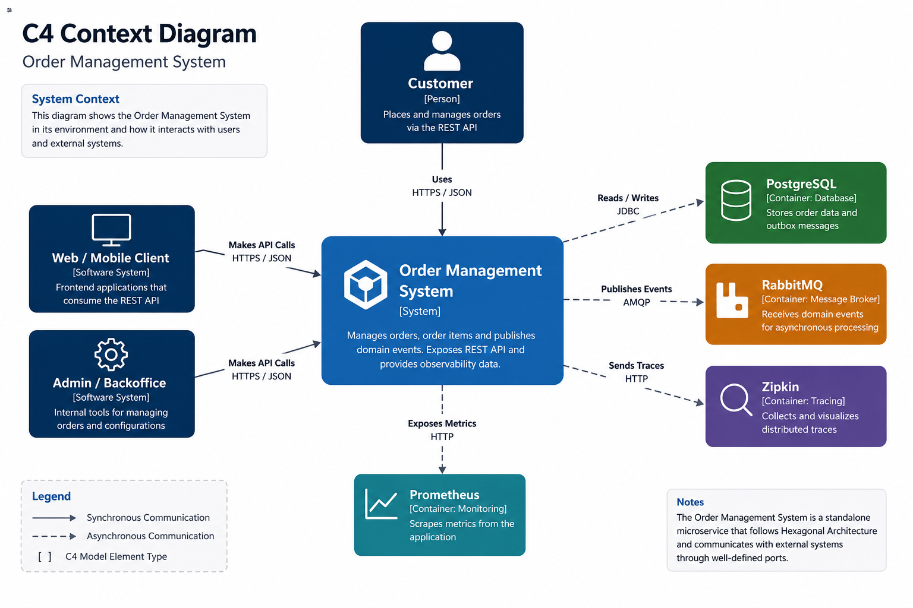
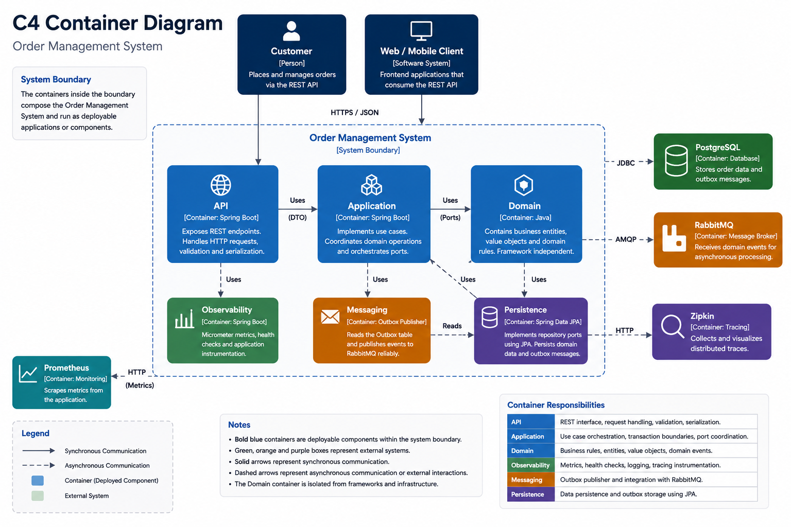
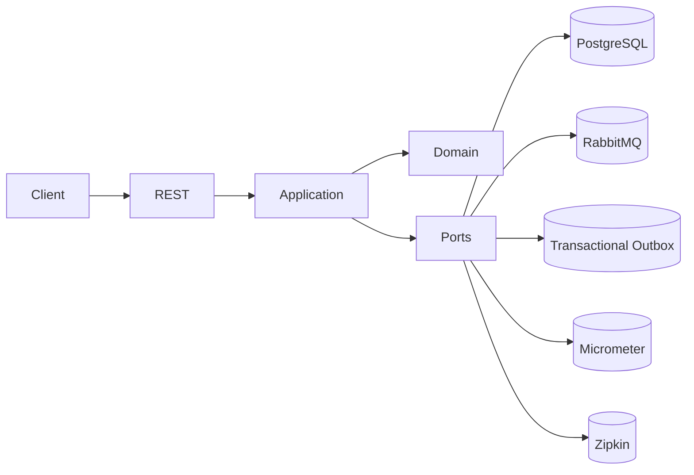
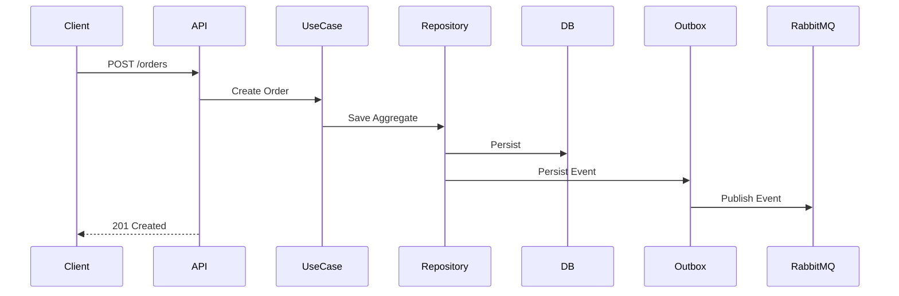
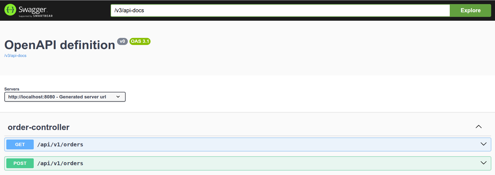

# Order Management System

> **Production-grade Java 21 backend** demonstrating enterprise software architecture with **Hexagonal Architecture**, **Clean Architecture**, **DDD principles**, **Transactional Outbox Pattern**, **RabbitMQ**, **PostgreSQL**, **distributed tracing**, and **production-ready observability**.

> This repository is an **engineering showcase**. Its primary goal is to demonstrate architectural decisions and backend engineering practices commonly adopted in production systems rather than implementing a feature-rich business application.

---

 &nbsp; &nbsp; &nbsp; &nbsp;  &nbsp; &nbsp; &nbsp; &nbsp;  &nbsp; &nbsp; &nbsp; &nbsp; 

---

# 🚀 Overview

This repository demonstrates how a modern Java backend can be designed using enterprise architecture patterns and production-ready engineering practices.

The application exposes a REST API for managing customer orders while serving as a reference implementation of framework-independent business logic, event-driven communication, and operational excellence.

---

# Table of Contents

- Why this project exists
- Architecture at a Glance
- Architecture Diagrams
- Design Principles
- Technology Stack
- Engineering Features
- Project Structure
- Observability
- Getting Started
- API Reference
- Testing Strategy
- Roadmap
- Design Goals
- Contributing
- License

---

# Why this project exists

Most public Spring Boot examples are CRUD-oriented and tightly coupled to the framework.

This project explores how a production-oriented backend can remain:

- framework-independent
- highly testable
- maintainable
- observable
- event-driven
- easy to evolve

The business domain is intentionally simple so the focus stays on software architecture and engineering quality.

---

# Architecture at a Glance

- Hexagonal Architecture
- Clean Architecture
- Framework-independent Domain
- Explicit Application Use Cases
- Dependency Inversion
- Transactional Outbox Pattern
- Event-driven Messaging
- Distributed Tracing
- Production Observability
- Integration Testing with Testcontainers

---

# Architecture

## C4 Context



## C4 Container



## High-Level Flow



## Order Creation Sequence



---

# Design Principles

- Hexagonal Architecture
- Clean Architecture
- SOLID
- Dependency Inversion
- Explicit Use Cases
- Framework-independent Domain
- Event-driven Integration
- Production-first Observability

---

# Architectural Decisions

## Why Hexagonal Architecture?

Separates business rules from infrastructure concerns.

## Why Framework-independent Domain?

Business logic should not depend on Spring, JPA or infrastructure frameworks.

## Why Transactional Outbox?

Prevents dual-write inconsistencies between the database and message broker.

## Why RabbitMQ?

Enables asynchronous communication and loose coupling.

## Why Micrometer?

Provides vendor-neutral metrics.

## Why Testcontainers?

Runs integration tests against real infrastructure.

## Architecture Decision Records

| ADR | Status | Description |
|-----|:------:|-------------|
| [ADR-0001](docs/adr/0001-hexagonal.md) | ✅ Accepted | Adopt Hexagonal Architecture |
| [ADR-0002](docs/adr/0002-outbox.md) | ✅ Accepted | Adopt the Transactional Outbox Pattern |
| [ADR-0003](docs/adr/0003-observability.md) | ✅ Accepted | Production-first Observability |
| [ADR-0004](docs/adr/0004-testing.md) | ✅ Accepted | Integration Testing with Testcontainers |

---

# Technology Stack

| Category | Technology |
|----------|------------|
| Language | Java 21 |
| Framework | Spring Boot |
| Database | PostgreSQL |
| Messaging | RabbitMQ |
| Documentation | OpenAPI |
| Metrics | Micrometer |
| Tracing | Zipkin |
| Health | Spring Boot Actuator |
| Testing | JUnit + Testcontainers |
| Containers | Docker |

---

# Engineering Features

- Framework-independent Domain
- Hexagonal Architecture
- Clean Architecture
- REST APIs
- Bean Validation
- Transactional Outbox
- RabbitMQ Integration
- Distributed Tracing
- Structured Logging
- Correlation IDs
- OpenAPI
- Testcontainers
- Docker
- Health Checks

---

# Project Structure

```text
src
├── core
├── app
├── infra
└── api
```

---

# Observability

Supported through:

- Spring Boot Actuator
- Micrometer
- Prometheus
- Zipkin
- MDC Correlation IDs

---

# Getting Started

## Prerequisites

- Java 21+
- Maven
- Docker

## Start Infrastructure

```bash
docker compose up -d
```

## Build

```bash
mvn clean install
```

## Run

```bash
mvn spring-boot:run -pl api/spring
```

---

# API Reference

| Method | Endpoint | Description |
|---------|----------|-------------|
| POST | /orders | Create Order |
| GET | /orders | List Orders |
| GET | /actuator/prometheus | Metrics |
| GET | /actuator/health | Health |



---

# Testing Strategy

- Unit Tests
- Integration Tests
- Testcontainers
- Real PostgreSQL
- Real RabbitMQ

```bash
mvn test
```

---

# Roadmap

- [x] Hexagonal Architecture
- [x] Clean Architecture
- [x] RabbitMQ
- [x] Transactional Outbox
- [x] OpenAPI
- [x] Docker
- [x] Testcontainers
- [ ] GitHub Actions
- [ ] SonarCloud
- [ ] JaCoCo
- [ ] Kubernetes
- [ ] Grafana Dashboards
- [ ] OAuth2
- [ ] Contract Testing

---

# Design Goals

This project intentionally prioritizes:

- Maintainability
- Scalability
- Architectural boundaries
- Observability
- Testability
- Long-term evolvability

rather than feature count.

---

# License

GPL v2 Only

